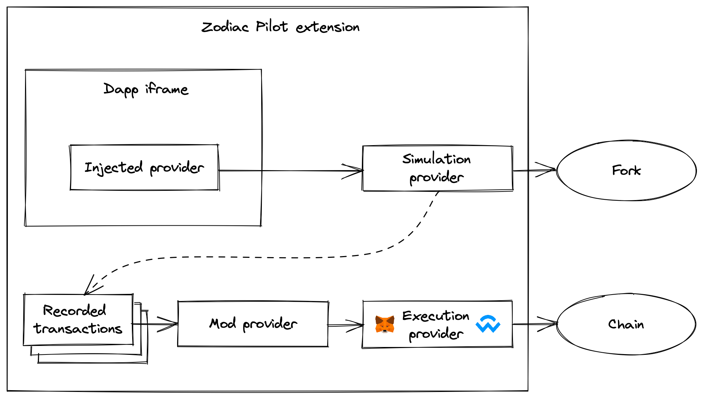

# Zodiac Pilot

[](https://github.com/gnosis/zodiac-pilot/actions/workflows/ci.yml)
[](https://github.com/gnosis/CODE_OF_CONDUCT)

Chrome extension to simulate Dapp interactions and record transactions. [Available on the Chrome Webstore](https://chrome.google.com/webstore/detail/zodiac-pilot/jklckajipokenkbbodifahogmidkekcb?hl=en&authuser=0)

## Contribute

### Run in development

Build a development bundle of the extension in watch mode:

```
yarn dev
```

The build output is written to public/build.

To enable the extension in Chrome, follow these steps:

1. Open the Extension Management page by navigating to [chrome://extensions](chrome://extensions).
2. Enable **Developer Mode** by clicking the toggle switch at the top right of the page.
3. Click the **Load unpacked** button and select the `zodiac-pilot/public` directory.

### Package for production

```
yarn build
```

## How it works

The extension consists of three different interacting pieces:

- **extension app:** This is the main app rendering the iframe. The entrypoint to the app is [launch.ts](extension/src/launch.ts) which is injected into pages running under the [Zodiac Pilot host](#zodiac-pilot-host) via a [content script](https://developer.chrome.com/docs/extensions/mv3/content_scripts/).
- **background script:** A [service worker script](https://developer.chrome.com/docs/extensions/mv3/intro/mv3-overview/#service-workers) that allows to hook into different Chrome events and APIs: [src/background.ts](extension/src/background.ts)
- **injected script:** Whenever we load any page in the the extension app iframe, we inject [src/inject.ts](extension/src/inject.ts) into the page so that this script runs in the context of that page. The injection happens via the content script at [src/contentScript.ts](extension/src/contentScript.ts).

The different scripts communicate exclusively via message passing. Extension page and background script use `chrome.runtime.sendMessage` while extension page and injected script talk via `window.postMessage`.

### Zodiac Pilot host

Originally, we started out building the Pilot as an extension page, which are hosted under `chrome-extension://<EXTENSION_ID>`. However extension pages are subject to some restrictions that make implementing certain integrations difficult, most notably:

- All extensions are sandboxed from each other, meaning that the MetaMask injected provider would not be available to an extension page.
- Extension pages have no access to Indexed DB, which is a dependency of Ganache. We might consider implementing a local forking mechanism using Ganache as an alternative to the existing Tenderly integration.

That's why the extension is now running under an external host, https://pilot.gnosisguild.org.

### Open Dapps in iframe

For allowing arbitrary pages to be loaded in our iframe we drop `X-Frame-Options` and `Content-Security-Policy` HTTP response headers for any requests originating from tabs showing our extension.

As we don't want to generally lift cross origin restrictions, we dynamically adjust the condition under which the [declarativeNetRequest](https://developer.chrome.com/docs/extensions/reference/declarativeNetRequest/) rule applies.
In our background script, we track tabs running our extension and will apply the header removal only for requests originating from any of these tabs.

### Syncing iframe location

The problem: When the user navigates the Dapp, the address bar of the Zodiac Pilot should update accordingly.
The browser back button should function as usual and when reloading the extension page the iframe should continue showing the original page.
Since browsers block access to foreign origin iframes we need to leverage Chrome extension super powers to detect navigation events in the iframe.

The solution: We listen to `chrome.tabs.onUpdated` in the background script and notify the content script about it via a message, which relays the message to the extension app.
This relaying is necessary because a background script can not directly talk to an externally hosted app.
For retrieving the new iframe location, we then post a message to the injected script in the iframe window, which will send us the response in another message.

### Inject EIP-1193 provider

When the simulator iframe opens any page, we inject the build/inject.js script as a node into the DOM of the Dapp.

The injected script then runs in the context of the Dapp and injects an [EIP-1193](https://eips.ethereum.org/EIPS/eip-1193) compatible API at `window.ethereum`.
The injected provider forwards all `request` calls to the parent extension page via `window.postMessage` where they are recorded and executed in a fork of the connected network.

### Simulating transaction in a fork

When the provider we inject into the Dapp iframe receives a transaction request, we record it and simulate the transaction in a fork of the target network, impersonating the Safe.
That way the app can continue communicating with the fork network, so that a whole session of multiple transactions can be recorded before anything is signed and submitted to the real chain.

<!-- There are two options available for simulating transactions in a fork, [Tenderly](https://tenderly.co) and a [Ganache](https://trufflesuite.com/ganache/) EVM running locally in the browser.

#### Tenderly -->

Tenderly provides rich debugging capabilities, which help in understanding the exact effects of each recorded transaction before actually signing anything.
Fresh forks are created via Tenderly's Simulation API and each fork will have its own JSON RPC URL.

<!-- #### Local fork with Ganache (under development)

We use Ganache to run a local EVM with a fork of the network the user is connected to.

TODO: The following is still true, but we should adjust the implementation now that the extension is running under an external host.

> Ganache depends on Indexed DB, which is not available to extension pages. For this reason we run it via an injected script on an externally hosted page in an iframe.
> Again we communicate via `window.postMessage`. That way we connect Ganache to the WalletConnect provider in the extension page so it can fork the active network.
> At the same time, we connect the Dapp injected provider to [`ForkProvider`](src/providers/ForkProvider.ts) in the host page, which forwards requests to the Ganache provider running in the ganache iframe. -->

### Reroute JSON-RPC fetch requests

Apps commonly make read-only JSON-RPC requests to providers such as Infura or Alchemy rather than going through the EIP-1193 provider injected by the wallet.
Once the network has been forked for simulating recorded transaction such requests should reflect the state of the fork as well.

This first requires detecting which of the JSON-RPC endpoints used by an app actually serve the forked network.
The `webRequest` extension API allows inspecting the body of each outgoing request.
If a requests looks like a JSON-RPC request we probe the target endpoint for `requestChainId`.

Once the network is forked we update `declarativeNetRequest` xhr redirection rules for endpoints identified as serving the forked network.
All of this is implemented as part of the [background service worker](src/background.ts).

### Submitting transactions

A batch of recorded transaction can finally be submitted as a multi-send transaction.
Zodiac Pilot can be configured to submit transactions directly to the Safe if the Pilot account is an owner or delegate, or to route the transaction through Zodiac mods.
This is implemented in [WrappingProvider](src/providers/WrappingProvider.ts).
It currently supports the [Roles](https://github.com/gnosis/zodiac-modifier-roles) and [Delay](https://github.com/gnosis/zodiac-modifier-delay) mods.

### Overview of providers


