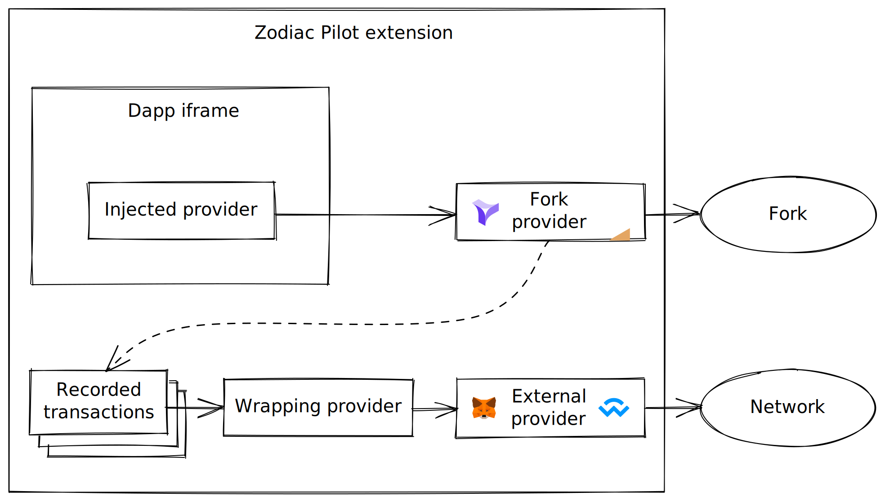

# Zodiac Pilot

[](https://github.com/gnosis/zodiac-pilot/actions/workflows/ci.yml)
[](https://github.com/gnosis/CODE_OF_CONDUCT)

Chrome extension to simulate Dapp interactions and record transactions. [Available on the Chrome Webstore](https://chrome.google.com/webstore/detail/zodiac-pilot/jklckajipokenkbbodifahogmidkekcb?hl=en&authuser=0)

## Contribute

### Run in development

Build a development bundle of the extension in watch mode:

```
yarn dev
```

The build output is written to public/build.

To enable the extension in Chrome, follow these steps:

1. Open the Extension Management page by navigating to [chrome://extensions](chrome://extensions).
2. Enable **Developer Mode** by clicking the toggle switch at the top right of the page.
3. Click the **Load unpacked** button and select the `zodiac-pilot/public` directory.

### Package for production

```
yarn build
```

## How it works

The extension consists of three different interacting pieces:

- **extension page:** This is the main app rendering the iframe. Entrypoint: [public/index.html](public/index.html) together with [src/app.tsx](src/app.tsx)
- **background script:** A [service worker script](https://developer.chrome.com/docs/extensions/mv3/intro/mv3-overview/#service-workers) that allows to hook into different Chrome events and APIs: [src/background.ts](src/background.ts)
- **injected script:** Whenever we load any page in the iframe, we inject [src/inject.ts](src/inject.ts) into the page so that this script runs in the context of that page. The injection happens via the [content script](https://developer.chrome.com/docs/extensions/mv3/content_scripts/) at [src/contentScript.ts](src/contentScript.ts).

The different scripts communicate exclusively via message passing. Extension page and background script use `chrome.runtime.sendMessage` while extension page and injected script talk via `window.postMessage`.

### Open Dapps in iframe

For allowing arbitrary pages to be loaded in our iframe we drop `X-Frame-Options` and `Content-Security-Policy` HTTP response headers for any requests originating from tabs showing our extension.

As we don't want to generally lift cross origin restrictions, we dynamically adjust the condition under which the [declarativeNetRequest](https://developer.chrome.com/docs/extensions/reference/declarativeNetRequest/) rule applies.
In our background script, we track tabs running our extension and will apply the header removal only for requests originating from any of these tabs.

### Syncing iframe location

The problem: When the user navigates the Dapp, the address bar of the Zodiac Pilot should update accordingly.
The browser back button should function as usual and when reloading the extension page the iframe should continue showing the original page.
Since browsers block access to foreign origin iframes we need to leverage Chrome extension super powers to detect navigation events in the iframe.

The solution: We listen to `chrome.tabs.onUpdated` from any of our extension tabs events in the background script.
This fires on location updates within any of our extension pages and we notify our extension page about it using `chrome.runtime.sendMessage`.
For retrieving the new iframe location, we then post a message to the iframe window, which will send us the response in another message.

### Inject EIP-1193 provider

When the simulator iframe opens any page, we inject the build/inject.js script as a node into the DOM of the Dapp.

The injected script then runs in the context of the Dapp and injects an [EIP-1193](https://eips.ethereum.org/EIPS/eip-1193) compatible API at `window.ethereum`.
The injected provider forwards all `request` calls to the parent extension page via `window.postMessage` where they are handled with on of our providers.
We currently offer two kinds of providers, the `WrappingProvider` for synchronously dispatching the transaction as a meta transaction of a Zodiac module function call, and `ForkProvider` for simulating the transaction in a local fork of the connected network and recording it for later batch transmission.

### Wrapping of transactions

The [WrappingProvider](src/providers/WrappingProvider.ts) takes any transaction requests received from the iframe and encodes them into `execTransactionFromModule` function calls to the configured target module address.
It then forwards the wrapped transaction request to the WalletConnect provider.

### Simulating transaction in local fork

We use Ganache to run a local EVM with a fork of the network the user is connected to.
Ganache depends on Indexed DB, which is not available to extension pages. For this reason we run it via an injected script on an externally hosted page in an iframe.
Again we communicate via `window.postMessage`. That way we connect Ganache to the WalletConnect provider in the extension page so it can fork the active network.
At the same time, we connect the Dapp injected provider to [`ForkProvider`](src/providers/ForkProvider.ts) in the host page, which forwards requests to the Ganache provider running in the ganache iframe.

Ganache allows impersonating accounts. So we can send transactions from the Avatar address without a signature.

### Overview of providers


